# API Endpoint Diagram Fixed + Zoom Added ✅

## Issues Fixed

### 1. API Endpoint Structure Diagram Syntax Error ✅

**Problem**: Invalid arrow syntax in graph
```mermaid
AuthService --> A, B, C  ❌ Invalid - can't connect to multiple nodes
```

**Solution**: Individual connections
```mermaid
AuthService --> A
AuthService --> B
AuthService --> C
```

**Fixed Diagram**:

```mermaid
graph TD
    subgraph APIGateway[API Gateway]
        A[POST /api/v1/auth/login]
        B[GET /api/v1/auth/google]
        C[GET /api/v1/auth/google/callback]
        D[GET /api/v1/users/me]
        E[PUT /api/v1/users/me]
        F[GET /api/v1/events]
        G[POST /api/v1/events]
        H[GET /api/v1/events/:id]
        I[PUT /api/v1/events/:id]
        J[DELETE /api/v1/events/:id]
        K[GET /api/v1/tasks]
        L[POST /api/v1/tasks]
        M[PUT /api/v1/tasks/:id/complete]
        N[GET /api/v1/rewards]
        O[POST /api/v1/rewards/redeem]
        P[GET /api/v1/notifications]
        Q[POST /api/v1/sync/google]
    end

    subgraph Services[Backend Services]
        AuthService[Auth Service]
        UserService[User Service]
        CalendarService[Calendar Service]
        TaskService[Task Service]
        RewardService[Reward Service]
        NotificationService[Notification Service]
        SyncService[Sync Service]
    end

    AuthService --> A
    AuthService --> B
    AuthService --> C
    UserService --> D
    UserService --> E
    CalendarService --> F
    CalendarService --> G
    CalendarService --> H
    CalendarService --> I
    CalendarService --> J
    TaskService --> K
    TaskService --> L
    TaskService --> M
    RewardService --> N
    RewardService --> O
    NotificationService --> P
    SyncService --> Q
```


### 2. Added Zoom/Pan to All Mermaid Diagrams ✅

**Changes Made**:

**1. Mermaid Configuration** (`WalkthroughGenerator.tsx`):
```typescript
mermaid.initialize({
    startOnLoad: true,
    theme: 'default',
    securityLevel: 'loose',
    flowchart: {
        useMaxWidth: false,  // ← Allows diagrams to expand
        htmlLabels: true
    },
    er: {
        useMaxWidth: false   // ← Allows ER diagrams to expand
    },
    sequence: {
        useMaxWidth: false   // ← Allows sequence diagrams to expand
    }
});
```

**2. Scrollable Container**:
```tsx
<div className="p-4 bg-white dark:bg-gray-900 overflow-auto max-h-96">
    <div className="mermaid min-w-max">
        {diagram}
    </div>
</div>
```

**Features**:
- ✅ **Horizontal scroll** for wide diagrams
- ✅ **Vertical scroll** for tall diagrams
- ✅ **Max height** of 384px (24rem) to prevent excessive height
- ✅ **Min width** allows diagram to expand naturally
- ✅ **Smooth scrolling** with native browser controls

## Results

**Diagrams Fixed**:
- `walkthrough_text.json`: 1 diagram (System Architecture)
- `walkthrough_image.json`: 2 diagrams (System Architecture + API Endpoints)
- **Total**: 3 diagrams fixed

**All Diagrams Now Have**:
- ✅ Scrollable containers
- ✅ Horizontal and vertical panning
- ✅ No width constraints
- ✅ Better viewing for complex diagrams

## How to Use

### Viewing Large Diagrams

1. **Horizontal Scroll**: Drag scrollbar or use mouse wheel + Shift
2. **Vertical Scroll**: Drag scrollbar or use mouse wheel
3. **Touchpad**: Two-finger scroll in any direction
4. **Mouse**: Click and drag scrollbar

### Example: API Endpoint Diagram

```
┌─────────────────────────────────────────┐
│ Diagram 1                    [Copy]     │
├─────────────────────────────────────────┤
│ ┌───────────────────────────────────┐ ◄─┤ Horizontal scroll
│ │                                   │   │
│ │  [API Gateway]    [Services]      │   │
│ │   ├─ POST /auth   ├─ AuthService  │   │
│ │   ├─ GET /users   ├─ UserService  │   │
│ │   └─ ...          └─ ...          │   │
│ │                                   │   │
│ └───────────────────────────────────┘   │
│                                       ▲  │
│                                       │  │
│                                   Vertical
│                                    scroll
└─────────────────────────────────────────┘
```

## Testing

1. **Refresh browser** (Cmd+R or Ctrl+R)
2. **Go to Mission Control**
3. **Click "Generate Code Walkthrough"**
4. **Click "View Existing"**
5. **Click "Image-Based" tab**
6. **Expand "API Endpoint Structure"**
7. **See rendered diagram with scroll**
8. **Try scrolling** horizontally and vertically

## Benefits

### Before
- ❌ Diagrams cut off at container width
- ❌ No way to see full diagram
- ❌ Syntax errors prevented rendering

### After
- ✅ Diagrams expand to full size
- ✅ Scroll to see all parts
- ✅ All diagrams render correctly
- ✅ Better UX for complex diagrams

## Files Modified

1. **`fix_api_diagram.py`** - Script to fix API endpoint diagram
2. **`WalkthroughGenerator.tsx`** - Added zoom/scroll functionality
3. **`walkthrough_text.json`** - Fixed System Architecture diagram
4. **`walkthrough_image.json`** - Fixed System Architecture + API Endpoints

## Summary

✅ **Fixed API Endpoint diagram** - Correct graph syntax  
✅ **Added scroll/pan** to all Mermaid diagrams  
✅ **Max height** prevents excessive vertical space  
✅ **Min width** allows diagrams to expand  
✅ **Better UX** for viewing complex diagrams  

All Mermaid diagrams now render correctly and are fully viewable! 🎉
