# SparkToShip - Architecture Diagrams

This document contains comprehensive Mermaid architecture diagrams for the SparkToShip system.

## Table of Contents
1. [System Architecture Overview](#system-architecture-overview)
2. [Agent Ecosystem](#agent-ecosystem)
3. [Data Flow Architecture](#data-flow-architecture)
4. [Backend Architecture](#backend-architecture)
5. [Frontend Architecture](#frontend-architecture)
6. [Deployment Architecture](#deployment-architecture)
7. [Sequence Diagrams](#sequence-diagrams)

---

## System Architecture Overview

### High-Level System Architecture

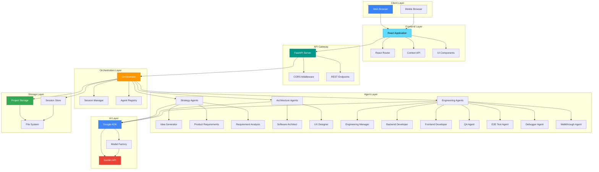

---

## Agent Ecosystem

### Agent Team Structure

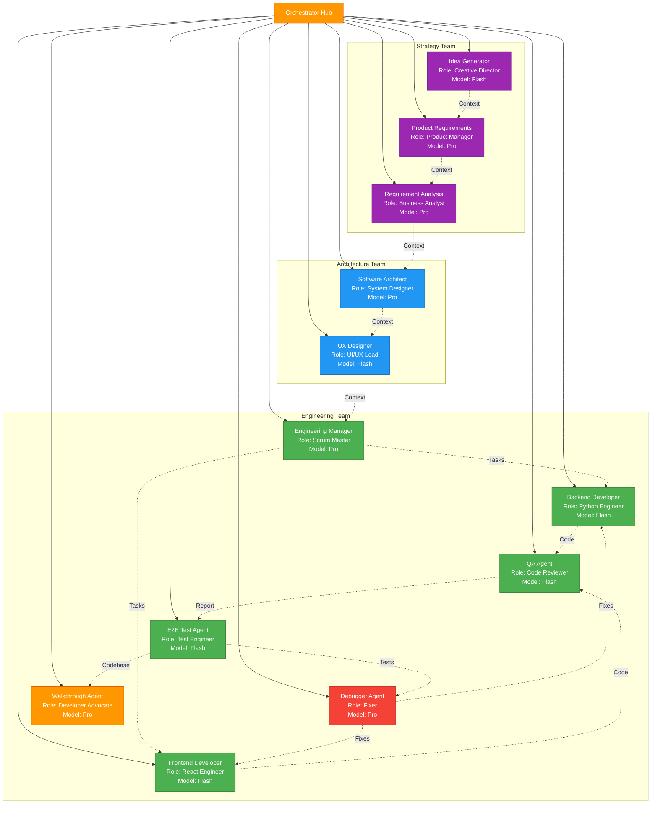

### Agent Communication Pattern

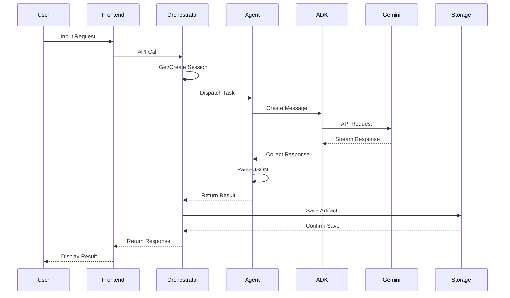

---

## Data Flow Architecture

### Complete Workflow Data Flow

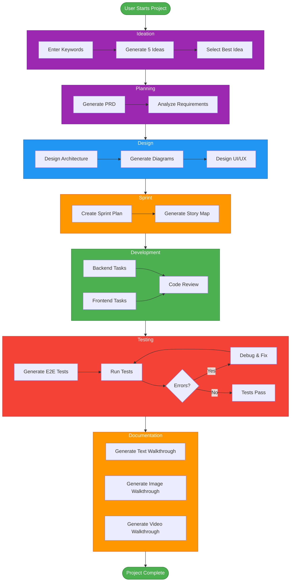

### State Management Flow

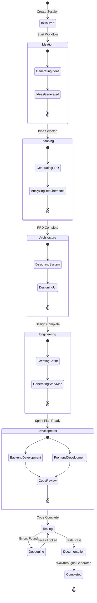

---

## Backend Architecture

### Backend Component Architecture

```mermaid
graph TB
    subgraph "FastAPI Application"
        Main[main.py<br/>Application Entry]
        Endpoints[API Endpoints]
        Middleware[CORS Middleware]
        
        Main --> Endpoints
        Main --> Middleware
    end
    
    subgraph "Core Layer"
        Config[config.py<br/>Settings]
        Orchestrator[orchestrator.py<br/>Session Manager]
        ModelFactory[model_factory.py<br/>AI Models]
        Services[services.py<br/>ADK Session]
        
        Config --> ModelFactory
        Orchestrator --> Services
    end
    
    subgraph "Agent Layer"
        direction TB
        
        subgraph "Strategy"
            IdeaGen[idea_generator.py]
            PRD[product_requirements.py]
            ReqAnalysis[requirement_analysis.py]
        end
        
        subgraph "Architecture"
            SoftArch[software_architect.py]
            UX[ux_designer.py]
        end
        
        subgraph "Engineering"
            EngMgr[engineering_manager.py]
            BackendDev[backend_dev.py]
            FrontendDev[frontend_dev.py]
            QA[qa_agent.py]
            E2E[e2e_test_agent.py]
            Debugger[debugger_agent.py]
            Walkthrough[walkthrough_agent.py]
        end
    end
    
    subgraph "Service Layer"
        ProjectStorage[project_storage.py<br/>File Persistence]
    end
    
    subgraph "Utility Layer"
        ADKHelper[adk_helper.py<br/>Response Parsing]
        FileUtils[file_utils.py<br/>File Operations]
        JSONUtils[json_utils.py<br/>JSON Handling]
    end
    
    subgraph "External Services"
        GeminiAPI[Gemini API]
        FileSystem[File System<br/>data/]
    end
    
    Endpoints --> Orchestrator
    Orchestrator --> IdeaGen
    Orchestrator --> PRD
    Orchestrator --> ReqAnalysis
    Orchestrator --> SoftArch
    Orchestrator --> UX
    Orchestrator --> EngMgr
    Orchestrator --> BackendDev
    Orchestrator --> FrontendDev
    Orchestrator --> QA
    Orchestrator --> E2E
    Orchestrator --> Debugger
    Orchestrator --> Walkthrough
    
    IdeaGen --> ModelFactory
    PRD --> ModelFactory
    ReqAnalysis --> ModelFactory
    SoftArch --> ModelFactory
    UX --> ModelFactory
    EngMgr --> ModelFactory
    BackendDev --> ModelFactory
    FrontendDev --> ModelFactory
    QA --> ModelFactory
    E2E --> ModelFactory
    Debugger --> ModelFactory
    Walkthrough --> ModelFactory
    
    ModelFactory --> GeminiAPI
    
    IdeaGen --> ADKHelper
    PRD --> ADKHelper
    
    Orchestrator --> ProjectStorage
    ProjectStorage --> FileSystem
    
    style Main fill:#009688,stroke:#00695c,color:#fff
    style Orchestrator fill:#ff9800,stroke:#e65100,color:#fff
    style ModelFactory fill:#4285f4,stroke:#1967d2,color:#fff
    style ProjectStorage fill:#34a853,stroke:#188038,color:#fff
    style GeminiAPI fill:#ea4335,stroke:#c5221f,color:#fff
```

### Backend Request Flow

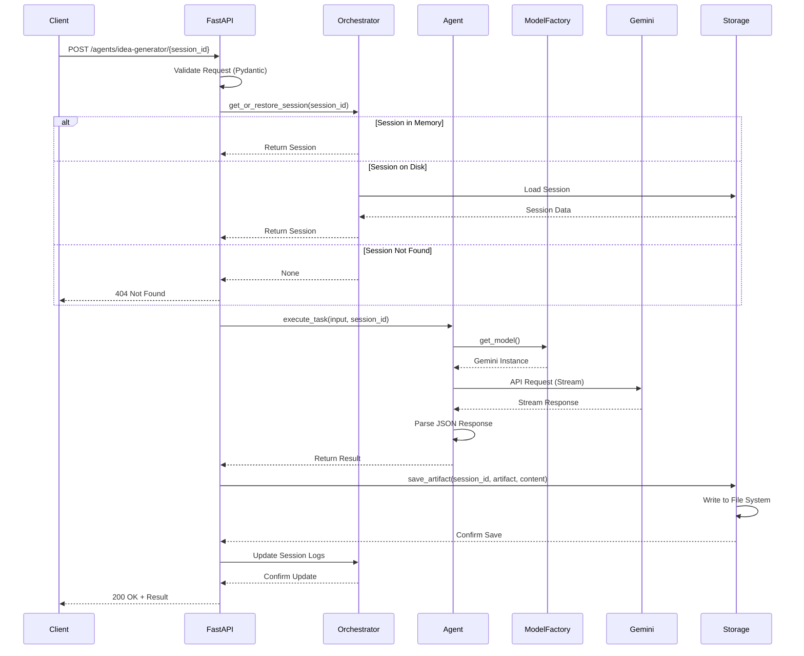

---

## Frontend Architecture

### Frontend Component Architecture

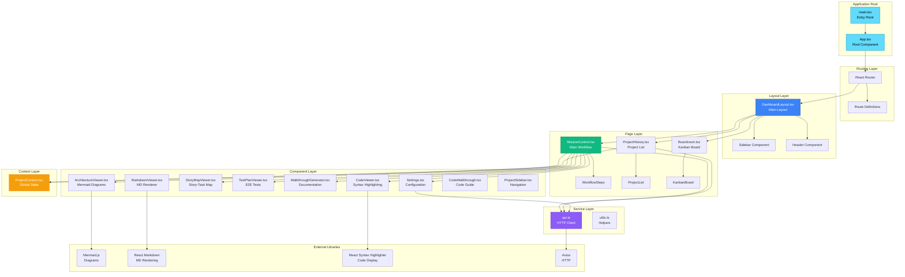

### Frontend State Flow

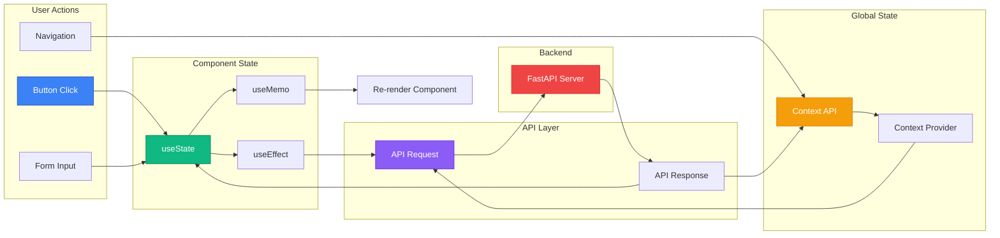

---

## Deployment Architecture

### Cloud Deployment Architecture

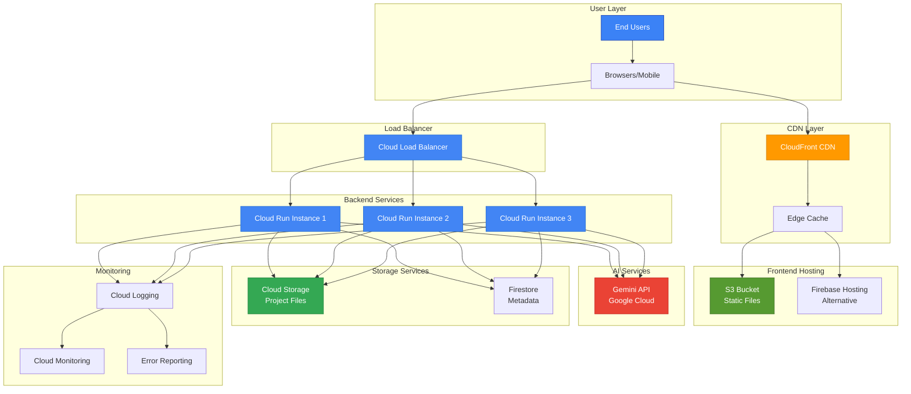

### Microservices Architecture (Future)

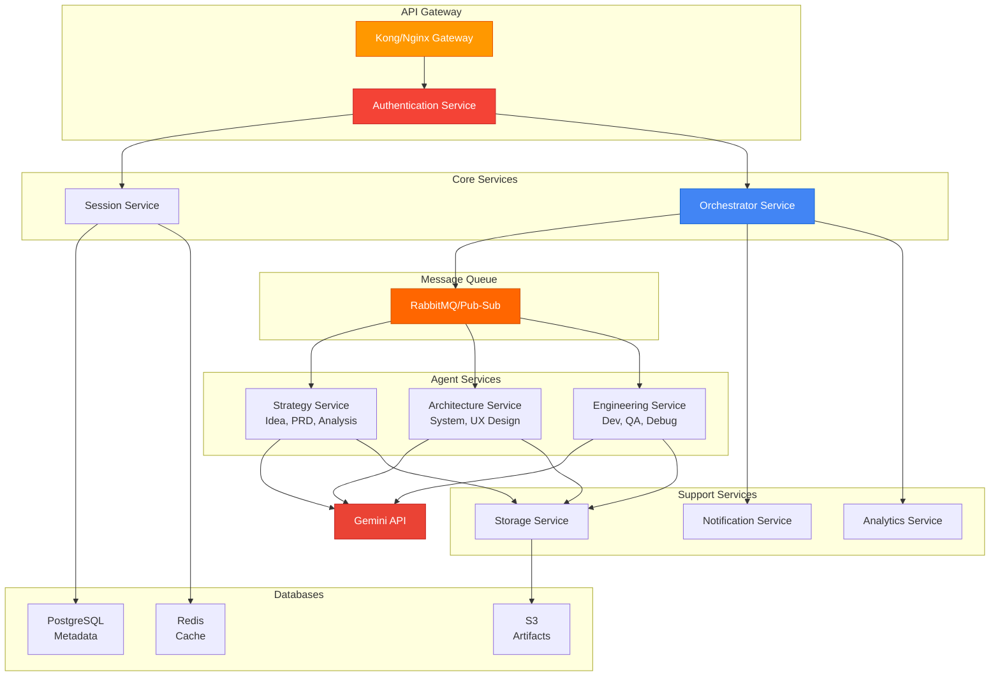

---

## Sequence Diagrams

### Complete Project Workflow Sequence

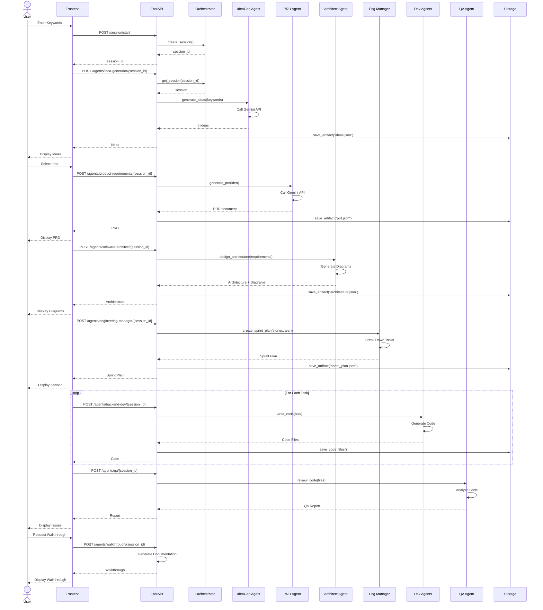

### Debugging Loop Sequence

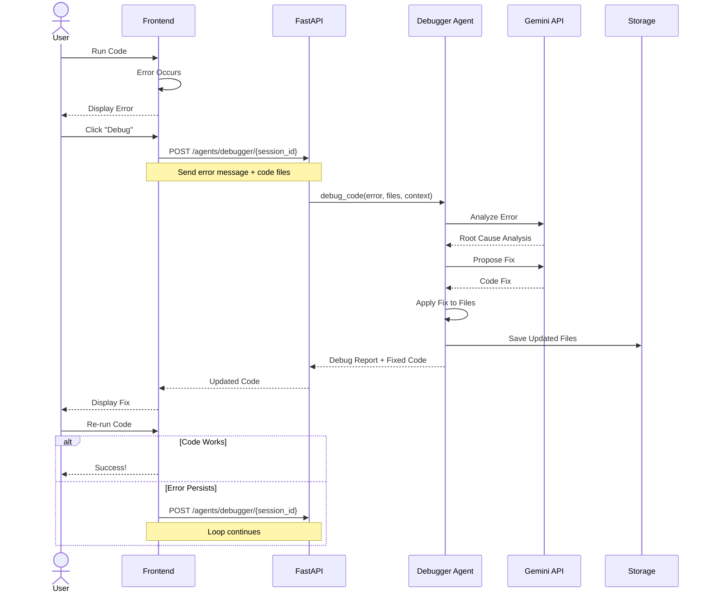

### Project Load/Save Sequence

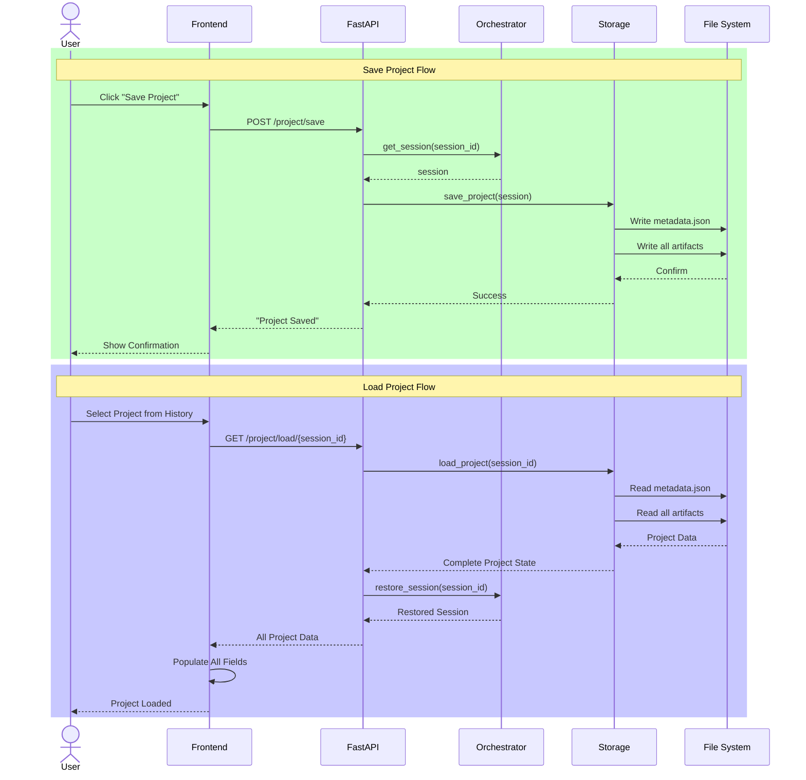

---

## Database Schema (Future Enhancement)

### Entity Relationship Diagram

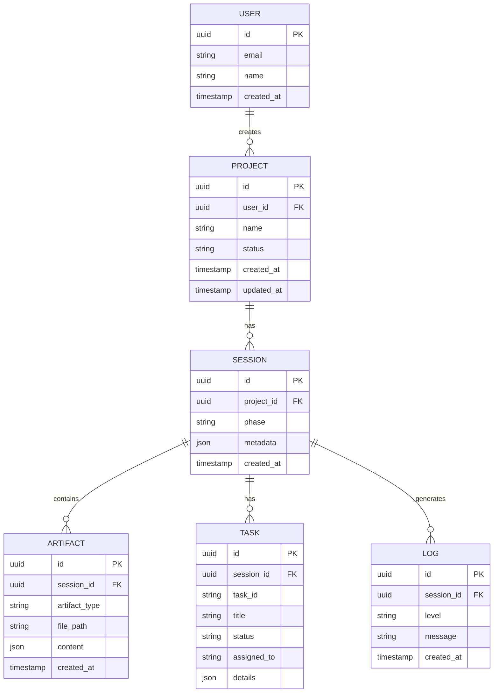

---

**Last Updated**: November 30, 2025
**Version**: 1.0.0

## How to Use These Diagrams

### Viewing in GitHub
These Mermaid diagrams will render automatically in GitHub markdown viewers.

### Viewing Locally
1. Use a Mermaid-compatible markdown viewer
2. Use [Mermaid Live Editor](https://mermaid.live)
3. Use VS Code with Mermaid extension

### Exporting
```bash
# Install Mermaid CLI
npm install -g @mermaid-js/mermaid-cli

# Export to PNG
mmdc -i ARCHITECTURE_DIAGRAMS.md -o architecture.png

# Export to SVG
mmdc -i ARCHITECTURE_DIAGRAMS.md -o architecture.svg
```
