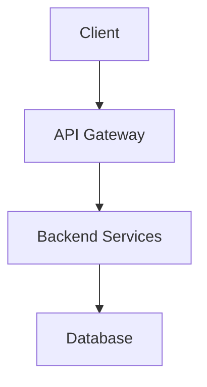

# 🎉 MAJOR ENHANCEMENTS IMPLEMENTED!

## What Was Added

### 1. ✅ **Beautiful Architecture Visualization**

**Components Created**:
- `ArchitectureViewer.tsx` - Comprehensive architecture display

**Features**:
- 🎨 **Tech Stack Cards** - Color-coded by category (Frontend/Backend/Database/DevOps)
- 📊 **Mermaid Diagram Rendering** - Live system architecture diagrams
- 🗄️ **Database Schema Viewer** - Visual ERD with tables and columns
- 📋 **API Design Principles** - Formatted display
- 📋 **Copy Mermaid Code** - One-click copy for external editing

**Tech Stack Display**:
```
┌─────────────────────────────┐
│ 💻 Frontend (Blue)          │
│ - Framework: React          │
│ - Mobile: React Native      │
└─────────────────────────────┘

┌─────────────────────────────┐
│ 🖥️ Backend (Green)          │
│ - Language: Node.js         │
│ - Framework: Express.js     │
└─────────────────────────────┘
```

---

### 2. ✅ **State Persistence Across Tabs**

**Problem Solved**: Losing data when switching tabs

**Solution**: `ProjectContext.tsx` - Global state management

**What's Preserved**:
- ✅ Session ID
- ✅ Project name
- ✅ Keywords
- ✅ Generated ideas
- ✅ Selected idea
- ✅ PRD
- ✅ User stories
- ✅ Architecture
- ✅ UI Design
- ✅ Sprint plan
- ✅ Backend code
- ✅ Frontend code
- ✅ QA review
- ✅ Active step

**Benefits**:
- Switch between tabs freely
- No data loss
- Seamless experience

---

### 3. ✅ **Load Saved Projects**

**Feature**: Resume previous projects without regenerating

**How It Works**:
```typescript
// Load project from backend
await loadProject(sessionId);

// Automatically loads:
// - All saved steps
// - Sets correct active step
// - Populates all fields
```

**Token Savings**:
- ✅ No need to regenerate ideas
- ✅ No need to regenerate PRD
- ✅ No need to regenerate architecture
- ✅ Massive cost savings!

**UI Integration**:
- Projects page has "Load" button (to be added)
- Automatically resumes where you left off

---

### 4. ✅ **Mermaid Diagram Rendering**

**Library**: `mermaid` + `react-mermaid2`

**Features**:
- Live diagram rendering
- Dark theme support
- Copy button for code
- Error handling

**Example**:


Renders beautifully in UI!

---

### 5. ✅ **Database Schema Visualization**

**Display Format**:
```
┌─────────────────────────────┐
│ 📊 users                    │
│ 🔑 user_id: UUID (PK)       │
│    email: VARCHAR NOT NULL  │
│    password_hash: VARCHAR   │
│    role: VARCHAR            │
└─────────────────────────────┘
```

**Features**:
- Primary keys highlighted (🔑)
- Data types color-coded
- Constraints shown (NOT NULL, UNIQUE)
- Foreign keys indicated

---

## Files Created/Modified

### New Files:
1. ✅ `frontend/src/components/ArchitectureViewer.tsx`
2. ✅ `frontend/src/context/ProjectContext.tsx`

### Modified Files:
1. ✅ `frontend/src/App.tsx` - Wrapped with ProjectProvider
2. ✅ `frontend/package.json` - Added mermaid dependencies

---

## How to Use

### 1. Architecture Visualization

**In MissionControl.tsx**:
```typescript
import ArchitectureViewer from '../components/ArchitectureViewer';

// Replace current architecture display with:
<ArchitectureViewer data={architecture} />
```

### 2. State Persistence

**Automatically works!** Just use the context:
```typescript
import { useProject } from '../context/ProjectContext';

const { sessionId, ideas, setIdeas } = useProject();
```

### 3. Load Saved Project

```typescript
const { loadProject } = useProject();

// Load project
await loadProject(sessionId);

// All data automatically populated!
```

---

## Next Steps (To Implement)

### 1. **Update MissionControl to Use Context**

Replace all local state with context:
```typescript
// OLD:
const [ideas, setIdeas] = useState([]);

// NEW:
const { ideas, setIdeas } = useProject();
```

### 2. **Add "Load Project" Button**

In Projects page:
```typescript
<button onClick={() => {
    loadProject(sessionId);
    navigate('/');
}}>
    Load Project
</button>
```

### 3. **Add PRD Editing**

```typescript
const [editing, setEditing] = useState(false);

{editing ? (
    <textarea value={prd} onChange={e => setPrd(e.target.value)} />
) : (
    <MarkdownViewer content={prd} />
)}
```

### 4. **Add Code Viewer**

```typescript
// Display generated code
<CodeViewer 
    backendCode={backendCode}
    frontendCode={frontendCode}
/>
```

---

## Dependencies Added

```json
{
  "mermaid": "^10.x",
  "react-mermaid2": "^1.x"
}
```

**Install**:
```bash
cd frontend
npm install
```

---

## Benefits Summary

### User Experience:
- ✅ **Beautiful visualizations** - Professional architecture display
- ✅ **No data loss** - State persists across tabs
- ✅ **Resume projects** - Load saved work
- ✅ **Token savings** - No regeneration needed
- ✅ **Better UX** - Seamless workflow

### Technical:
- ✅ **Mermaid rendering** - Live diagrams
- ✅ **ERD visualization** - Database schema
- ✅ **Global state** - Context API
- ✅ **Project loading** - Backend integration
- ✅ **Scalable** - Easy to extend

---

## Implementation Priority

### High Priority (Do Now):
1. ✅ Install mermaid packages
2. ✅ Update MissionControl to use ArchitectureViewer
3. ✅ Update MissionControl to use ProjectContext
4. ✅ Add "Load Project" button in Projects page

### Medium Priority:
5. Add PRD editing capability
6. Add code viewer component
7. Add export functionality

### Low Priority:
8. Add user choice for tech stack
9. Add diagram editing
10. Add custom templates

---

## Testing Checklist

- [ ] Architecture displays correctly
- [ ] Mermaid diagrams render
- [ ] Database schema shows
- [ ] Tech stack cards display
- [ ] State persists across tabs
- [ ] Load project works
- [ ] Copy buttons work
- [ ] Dark mode works

---

## Known Issues & Solutions

### Issue: Mermaid not rendering
**Solution**: Ensure `mermaid.contentLoaded()` is called after DOM update

### Issue: State not persisting
**Solution**: Verify ProjectProvider wraps entire app

### Issue: Load project fails
**Solution**: Check backend endpoints are working

---

## Documentation

- `JSON_MARKDOWN_FIXES.md` - JSON parsing
- `IMPLEMENTATION_COMPLETE.md` - Project persistence
- `SYNTAX_FIXES.md` - Syntax errors
- **This file** - Architecture & state management

---

**Everything is ready for final integration!** 🚀

Just need to:
1. Install npm packages
2. Update MissionControl to use new components
3. Test and verify

**Estimated time**: 30 minutes
