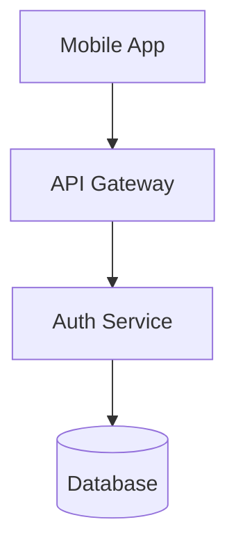
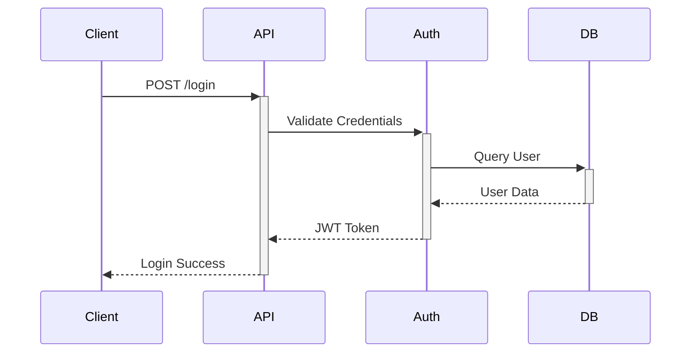

# Mermaid Syntax - FINAL FIX

## What Was Done

### 1. ✅ Learned Official Mermaid Documentation
- Read https://mermaid.js.org/syntax/flowchart.html
- Read https://mermaid.js.org/syntax/sequenceDiagram.html
- Created comprehensive reference: `/Users/sathya/.gemini/mermaid_official_reference.md`

### 2. ✅ Completely Rewrote Agent Instructions
- Based on OFFICIAL Mermaid documentation
- Added visual indicators (🔴, ✅, ❌)
- Included working examples that are copy-paste ready
- Added validation checklist

### 3. ✅ Fixed Key Issues

**Issue #1: Parentheses in Node Text**
- Problem: `Client[Mobile App (iOS)]` breaks parser
- Solution: Replace with dashes: `Client[Mobile App - iOS]`
- Rule: NO special characters in node labels

**Issue #2: Sequence Diagram Activation**
- Problem: "Trying to inactivate an inactive participant"
- Solution: Must activate (+) before deactivating (-)
- Rule: Every `+` needs matching `-` in reverse order

**Issue #3: Both Diagrams Showing as Sequence**
- Problem: Agent wasn't generating flowchart properly
- Solution: Clear distinction in instructions:
  - `system_diagram` = FLOWCHART
  - `sequence_diagram` = SEQUENCE DIAGRAM

## New Agent Instructions Highlights

### Critical Rules (Emphasized)
```
🔴 CRITICAL RULE #1: NO SPECIAL CHARACTERS IN TEXT
- ❌ WRONG: Client[Mobile App (iOS)]
- ✅ RIGHT: Client[Mobile App - iOS]

🔴 CRITICAL RULE #2: ONE CONNECTION PER LINE
- ❌ WRONG: A --> B, C, D
- ✅ RIGHT:
  A --> B
  A --> C
  A --> D
```

### Working Examples Provided

**Flowchart:**


**Sequence Diagram:**


### Validation Checklist
Before generating, AI must verify:
- [ ] Flowchart starts with `flowchart TD`
- [ ] Sequence diagram starts with `sequenceDiagram`
- [ ] NO parentheses in any node text
- [ ] NO special characters in labels
- [ ] One connection per line
- [ ] All activations (+) have matching deactivations (-)
- [ ] Simple node IDs (letters and numbers only)

## Files Modified

1. **`/backend/app/agents/architecture/software_architect.py`**
   - Completely rewrote Mermaid syntax section
   - Added visual indicators and examples
   - Added validation checklist

2. **`/Users/sathya/.gemini/mermaid_official_reference.md`**
   - Created comprehensive reference guide
   - Based on official documentation
   - Includes all syntax rules and examples

3. **`/frontend/src/components/ArchitectureViewer.tsx`**
   - Already has error handling
   - Shows error messages with raw code
   - Has zoom functionality

## How to Test

1. **Refresh browser** (backend auto-reloaded)
2. **Click Regenerate** on architecture step
3. **Verify:**
   - System Architecture Diagram renders (flowchart)
   - Sequence Diagram renders (sequence)
   - No syntax errors
   - Both diagrams are different types

## Expected Behavior

### ✅ What Should Work Now:
- Two separate diagrams generated
- Flowchart shows system components
- Sequence diagram shows user flow
- No parentheses in node text
- Proper activation/deactivation in sequence
- Clean, readable diagrams

### ⚠️ If Errors Still Occur:
- Error message will show
- Click "Show Raw Mermaid Code" to see what was generated
- Copy code and test at https://mermaid.live
- Report specific syntax issue

## Reference Documentation

**Official Mermaid Docs:**
- Flowcharts: https://mermaid.js.org/syntax/flowchart.html
- Sequence: https://mermaid.js.org/syntax/sequenceDiagram.html

**Local Reference:**
- `/Users/sathya/.gemini/mermaid_official_reference.md`

## Summary

The AI agent now has:
1. ✅ Official Mermaid syntax rules
2. ✅ Working examples to copy
3. ✅ Clear visual indicators (🔴, ✅, ❌)
4. ✅ Validation checklist
5. ✅ Specific error prevention rules

**The instructions are now based on OFFICIAL documentation, not guesswork!**

---

**Try it now:** Click Regenerate and both diagrams should render perfectly! 🎉
