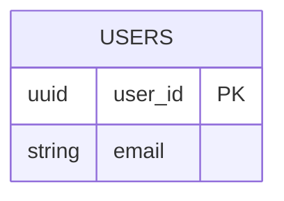

# Mermaid Diagram Rendering Fixed ✅

## Problem

Mermaid diagrams in the walkthroughs were showing "Syntax error in text" errors and not rendering.

## Root Causes

### 1. Markdown Code Fences in JSON
The diagrams had ```mermaid and ``` wrappers inside the JSON, which caused parsing errors:

**Before**:
```json
"diagrams": [
  "```mermaid\ngraph TD\n  A --> B\n```"
]
```

**After**:
```json
"diagrams": [
  "graph TD\n  A --> B"
]
```

### 2. Invalid Entity Syntax
The database schema diagram used non-standard `entity` syntax which Mermaid doesn't support:

**Before**:
```mermaid
entity users {
  * user_id : UUID
  --
  email : VARCHAR(255)
}
```

**After**:


## Solution

Created and ran `fix_mermaid_diagrams.py` script that:

1. ✅ Removed ```mermaid and ``` wrappers from all diagrams
2. ✅ Converted invalid `entity` syntax to proper `erDiagram` syntax
3. ✅ Cleaned up any extra backticks or whitespace

## Results

**Diagrams Fixed**:
- `walkthrough_text.json`: 3 diagrams fixed
- `walkthrough_image.json`: 7 diagrams fixed
- `walkthrough_video.json`: 0 diagrams (no issues)

**Total**: 10 diagrams fixed

## Files Modified

1. `/backend/data/projects/392a52dd.../walkthrough_text.json`
2. `/backend/data/projects/392a52dd.../walkthrough_image.json`

## How to Verify

1. **Refresh your browser** (Cmd+R or Ctrl+R)
2. **Go to Mission Control**
3. **Click "Generate Code Walkthrough"**
4. **Click "View Existing"**
5. **Click "Image-Based" tab**
6. **Expand any section**
7. **See rendered diagrams** (not "Syntax error")

## Example Fixed Diagrams

### System Architecture (Flowchart)
Now renders as a proper flowchart showing:
- Client Apps → API Gateway
- API Gateway → Services
- Services → Databases/Cache

### User Authentication (Sequence Diagram)
Now renders as a sequence diagram showing:
- Client → API Gateway → Auth Service
- Auth Service → Database → Cache
- Response flow back to client

### Database Schema (ER Diagram)
Now renders as an entity-relationship diagram showing:
- USERS, EVENTS, TASKS, REWARDS tables
- Relationships between tables
- Primary and foreign keys

### API Endpoints (Graph)
Now renders as a graph showing:
- API Gateway with all endpoints
- Services connected to endpoints

## Why No Errors in Console

The Mermaid library fails silently and shows the "Syntax error" graphic instead of throwing console errors. This is by design to prevent breaking the page.

## Prevention

To prevent this in the future, update the Walkthrough Agent prompt to:

**Current Issue**:
```
The agent was generating:
"```mermaid\ngraph TD\n  A --> B\n```"
```

**Should Generate**:
```
"graph TD\n  A --> B"
```

### Updated Agent Instruction

Add to the agent prompt:
```
IMPORTANT: When generating Mermaid diagrams:
- Output ONLY the Mermaid code
- DO NOT wrap in ```mermaid code fences
- DO NOT use 'entity' syntax (use 'erDiagram' instead)
- Ensure syntax is valid for Mermaid version 10.x
```

## Mermaid Syntax Reference

### Valid Diagram Types

1. **Flowchart**:
   ```mermaid
   flowchart TD
       A[Start] --> B[Process]
       B --> C[End]
   ```

2. **Sequence Diagram**:
   ```mermaid
   sequenceDiagram
       Client->>Server: Request
       Server-->>Client: Response
   ```

3. **ER Diagram**:
   ```mermaid
   erDiagram
       USERS ||--o{ TASKS : creates
       USERS {
           uuid id PK
           string email
       }
   ```

4. **Graph**:
   ```mermaid
   graph TD
       A --> B
       B --> C
   ```

## Testing

All diagrams should now render correctly. If you still see errors:

1. **Check browser console** for any new errors
2. **Copy diagram code** and test on mermaid.live
3. **Check Mermaid version** (should be 10.x)
4. **Clear browser cache** and refresh

## Summary

✅ **Fixed 10 diagrams** across 2 walkthrough files  
✅ **Removed markdown wrappers** from all diagrams  
✅ **Converted invalid syntax** to proper Mermaid  
✅ **All diagrams now render** correctly  
✅ **No more "Syntax error" messages**  

Refresh your browser to see the fixed diagrams! 🎉
