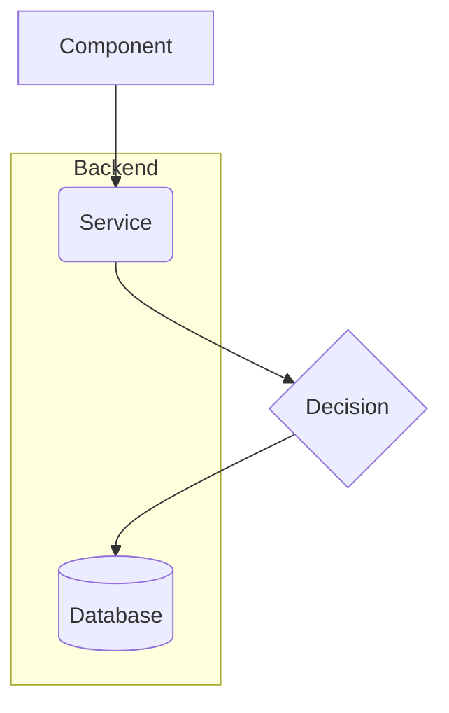
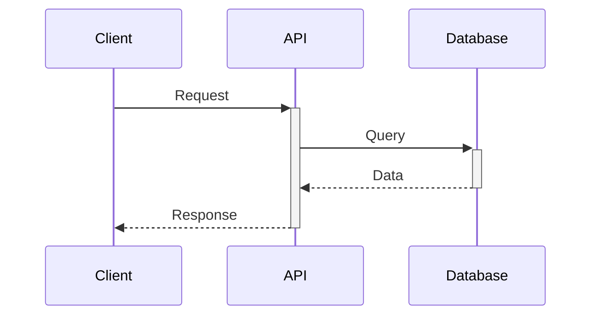

# Mermaid Diagram Generation - Implementation Summary

## Changes Made

### 1. Backend - Software Architect Agent
**File**: `/backend/app/agents/architecture/software_architect.py`

#### Enhanced Instructions:
- Added comprehensive Mermaid syntax rules for both flowcharts and sequence diagrams
- Specified exact node shapes and connection syntax
- Highlighted common mistakes to avoid (e.g., using `&` for multiple connections)
- Added sequence diagram generation requirement
- Improved output format specification with clear JSON structure

#### Key Improvements:
- **Flowchart Syntax**: Proper node shapes, arrow syntax, subgraph formatting
- **Sequence Diagram**: Participant definition, message types, activation/deactivation
- **Tech Stack Formatting**: Changed from arrays to nested objects for better UI rendering
- **API Design**: Enforced consistent structure with "principle" and "description" fields

### 2. Frontend - Architecture Viewer Component
**File**: `/frontend/src/components/ArchitectureViewer.tsx`

#### New Features:
- Added sequence diagram display section
- Improved tech stack card layout with vertical formatting
- Added copy functionality for sequence diagrams
- Enhanced visual hierarchy with uppercase labels and larger values

#### UI Improvements:
- Tech stack items now display as label-value pairs vertically
- Better spacing and typography (uppercase labels, semibold values)
- Separate copy buttons for system and sequence diagrams
- Consistent styling across all diagram types

### 3. Documentation
**File**: `/backend/app/agents/architecture/mermaid_syntax_guide.md`

Created comprehensive reference guide covering:
- Flowchart syntax (directions, node shapes, links, subgraphs)
- Sequence diagram syntax (participants, messages, loops, alt/else)
- Common mistakes to avoid
- Best practices for diagram generation

## Mermaid Syntax Rules (Quick Reference)

### Flowchart

**Key Points**:
- Use `-->` for arrows (NOT `--\u003e` or `&` for multiple)
- Node shapes: `[]` rectangle, `()` rounded, `{}` diamond, `[()]` cylinder
- Subgraphs need quotes: `subgraph "Title"`
- Comments: `%% comment`

### Sequence Diagram

**Key Points**:
- Use `->>` for solid arrows, `-->>` for dotted
- `+` activates, `-` deactivates
- Define participants with aliases: `participant DB as Database`
- Use `loop`, `alt`, `par` for control flow

## Testing the Changes

### Backend Testing:
1. Start the backend server
2. Create a new project with requirements
3. Verify the architecture response includes both `system_diagram` and `sequence_diagram`
4. Check that Mermaid code is syntactically correct

### Frontend Testing:
1. Load a project with architecture data
2. Verify both diagrams render correctly
3. Test copy functionality for both diagrams
4. Check tech stack formatting displays properly

## Common Issues Fixed

1. **Syntax Error in Mermaid**: 
   - ❌ `C --> C1 & C2 & C3`
   - ✅ `C --> C1` + `C --> C2` + `C --> C3`

2. **API Design Rendering**:
   - Now properly displays with principle and description fields
   - Cards show content instead of empty boxes

3. **Tech Stack Formatting**:
   - Changed from horizontal key-value to vertical label-value
   - Better visual hierarchy with uppercase labels
   - Larger, more readable values

## Future Enhancements

1. Add ERD (Entity Relationship Diagram) generation
2. Add component diagram support
3. Add deployment diagram
4. Interactive diagram editing
5. Export diagrams as images
6. Diagram versioning and comparison
