# Mermaid Diagram Syntax - Complete Reference

## 📚 Official Documentation
https://mermaid.js.org/intro/

## ✅ ER Diagrams (Entity Relationship Diagrams)

### Documentation
https://mermaid.js.org/syntax/entityRelationshipDiagram.html

### Syntax Rules

**1. Declaration**
```mermaid
erDiagram
```

**2. Relationships**
```
ENTITY1 [relationship] ENTITY2 : "relationship label"
```

**Cardinality Symbols**:
- `||` - Exactly one
- `|o` - Zero or one
- `}|` - One or more
- `}o` - Zero or more

**Relationship Types**:
- `||--o{` - One to many
- `||--|{` - One to one or more
- `}o--o{` - Zero or more to zero or more
- `||..o{` - Non-identifying relationship (dashed line)

**Examples**:
```mermaid
USERS ||--o{ TASKS : creates
USERS ||--|{ FAMILY_MEMBERS : "is member of"
PERSON }|..|{ CAR : driver
```

**3. Attributes**

**Format**: `type name key`

**Valid Types** (must start with alphabetic character):
- `string` - Text data
- `int` - Integer numbers
- `bool` - Boolean values
- `datetime` - Timestamps
- `date` - Dates
- `float` - Decimal numbers

**Valid Keys**:
- `PK` - Primary Key
- `FK` - Foreign Key
- `UK` - Unique Key
- `"PK, FK"` - Multiple keys (use quotes)

**Example**:


### ❌ Common Mistakes

**DON'T**:
```mermaid
erDiagram
    USERS {
        uuid user_id PK          ❌ 'uuid' doesn't start with letter
        text description         ❌ 'text' is not valid
        timestamp created_at     ❌ 'timestamp' is not valid
        string user_id PK_FK     ❌ Use "PK, FK" instead
    }
```

**DO**:
```mermaid
erDiagram
    USERS {
        string user_id PK        ✅ 'string' is valid
        string description       ✅ Use 'string' for text
        datetime created_at      ✅ Use 'datetime'
        string user_id "PK, FK"  ✅ Multiple keys in quotes
    }
```

---

## 📊 Flowcharts

### Documentation
https://mermaid.js.org/syntax/flowchart.html

### Syntax

**Declaration**:
```mermaid
flowchart TD    %% Top to bottom
flowchart LR    %% Left to right
flowchart BT    %% Bottom to top
flowchart RL    %% Right to left
```

**Node Shapes**:


**Connections**:
```mermaid
flowchart TD
    A --> B              %% Arrow
    A --- B              %% Line
    A -- Text --> B      %% Labeled arrow
    A -. Dotted .-> B    %% Dotted line
    A ==> B              %% Thick arrow
```

**Example**:


---

## 🔄 Sequence Diagrams

### Documentation
https://mermaid.js.org/syntax/sequenceDiagram.html

### Syntax

**Declaration**:
```mermaid
sequenceDiagram
```

**Participants**:


**Messages**:


**Message Types**:
- `->` - Solid line without arrow
- `-->` - Dotted line without arrow
- `->>` - Solid line with arrow
- `-->>` - Dotted line with arrow
- `-x` - Solid line with cross
- `--x` - Dotted line with cross

**Activations**:


**Example**:


---

## 📈 Graphs

### Documentation
https://mermaid.js.org/syntax/graph.html

### Syntax

**Declaration**:
```mermaid
graph TD    %% Top to bottom
graph LR    %% Left to right
```

**Similar to flowcharts but simpler**:


---

## 🎯 Best Practices

### 1. Always Use Correct Declaration

```mermaid
erDiagram          ✅ For ER diagrams
flowchart TD       ✅ For flowcharts
sequenceDiagram    ✅ For sequence diagrams
graph TD           ✅ For graphs
```


### 2. Use Valid Types in ER Diagrams
```mermaid
erDiagram
    TABLE {
        string field1    ✅ Valid
        int field2       ✅ Valid
        datetime field3  ✅ Valid
        uuid field4      ❌ Invalid - use 'string'
        text field5      ❌ Invalid - use 'string'
    }
```

### 3. Proper Key Notation
```mermaid
erDiagram
    TABLE {
        string id PK           ✅ Single key
        string user_id FK      ✅ Single key
        string email UK        ✅ Single key
        string ref "PK, FK"    ✅ Multiple keys (quoted)
        string bad PK_FK       ❌ Invalid format
    }
```

### 4. Clear Relationship Labels
```mermaid
erDiagram
    USERS ||--o{ TASKS : creates        ✅ Clear label
    USERS ||--o{ EVENTS : "schedules"   ✅ Quoted if needed
    USERS ||--o{ TASKS                  ✅ Label optional
```

### 5. Consistent Naming
```mermaid
erDiagram
    USERS          ✅ UPPERCASE for entities
    users          ✅ lowercase also works
    "User Table"   ✅ Quoted if spaces
```

---

## 🔧 Common Fixes

### Fix 1: Invalid Types
**Before**:
```mermaid
erDiagram
    USERS {
        uuid user_id PK
        text description
        timestamp created_at
    }
```

**After**:
```mermaid
erDiagram
    USERS {
        string user_id PK
        string description
        datetime created_at
    }
```

### Fix 2: Multiple Keys
**Before**:
```mermaid
erDiagram
    TABLE {
        string id PK_FK
    }
```

**After**:
```mermaid
erDiagram
    TABLE {
        string id "PK, FK"
    }
```

### Fix 3: Code Fences
**Before** (in JSON):
```json
"diagrams": [
  "```mermaid\nerDiagram\n  USERS {}\n```"
]
```

**After** (in JSON):
```json
"diagrams": [
  "erDiagram\n  USERS {}"
]
```

---

## 📝 Agent Instructions

When generating Mermaid diagrams for walkthroughs:

1. **NO code fences**: Output plain Mermaid code only
2. **Valid types**: Use string, int, bool, datetime, date
3. **Proper keys**: PK, FK, UK (or "PK, FK" for multiple)
4. **Clear labels**: Use descriptive relationship labels
5. **Correct syntax**: Follow official Mermaid documentation
6. **Test validity**: Ensure diagrams render on mermaid.live

---

## 🧪 Testing

Test your Mermaid diagrams at:
**https://mermaid.live**

Paste your diagram code and verify it renders correctly before using in production.

---

## 📚 Additional Resources

- **Official Docs**: https://mermaid.js.org/intro/
- **ER Diagrams**: https://mermaid.js.org/syntax/entityRelationshipDiagram.html
- **Flowcharts**: https://mermaid.js.org/syntax/flowchart.html
- **Sequence Diagrams**: https://mermaid.js.org/syntax/sequenceDiagram.html
- **Live Editor**: https://mermaid.live
- **GitHub**: https://github.com/mermaid-js/mermaid

---

## ✅ Summary

**Key Takeaways**:
1. ✅ Types must start with alphabetic characters
2. ✅ Use string, int, bool, datetime, date (not uuid, text, timestamp)
3. ✅ Keys: PK, FK, UK (not PK_FK)
4. ✅ No ```mermaid code fences in JSON
5. ✅ Test on mermaid.live before deploying

**This knowledge should be used for all future Mermaid diagram generation!**
