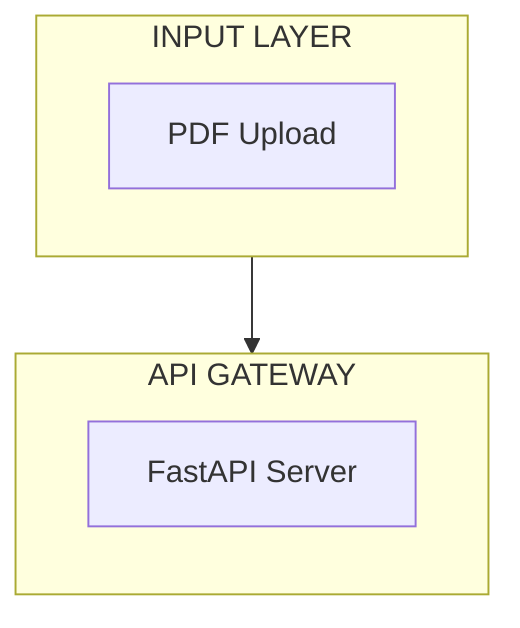

# Mermaid Diagrams vs Custom Images - Discussion

## Current Situation

You showed me the **Blue Ribbon** project diagrams which are **custom-designed images** with:
- Professional graphics and icons
- Custom color schemes and styling
- Hand-crafted layouts
- Visual elements like arrows, boxes, and flow indicators

I implemented **Mermaid diagrams** which are:
- Code-based diagrams
- Auto-generated from text
- Interactive and editable
- Consistent styling

---

## Comparison

### Blue Ribbon Approach (Custom Images)

**Pros**:
- ✅ Professional, polished appearance
- ✅ Custom icons and graphics
- ✅ Flexible layout and design
- ✅ Can include branding elements
- ✅ Visually impressive

**Cons**:
- ❌ Requires manual creation (time-consuming)
- ❌ Hard to update/modify
- ❌ Not interactive
- ❌ Difficult for AI to generate consistently
- ❌ Large file sizes

### Mermaid Approach (Current Implementation)

**Pros**:
- ✅ Easy for AI to generate
- ✅ Consistent syntax and structure
- ✅ Interactive (zoom, pan)
- ✅ Easy to update (just edit code)
- ✅ Version controllable
- ✅ Small file size (text-based)
- ✅ Can be rendered anywhere

**Cons**:
- ❌ Limited styling options
- ❌ No custom icons
- ❌ Less visually impressive
- ❌ Fixed layout options

---

## Options Going Forward

### Option 1: Keep Mermaid (Recommended)

**Why**: 
- Gemini 2.0 Flash can reliably generate Mermaid code
- Easy to maintain and update
- Works well for technical documentation
- Already implemented and working

**What you get**:

### Option 2: Generate Images with AI

**How it would work**:
1. Use Gemini to generate a detailed description
2. Use image generation API (DALL-E, Midjourney, etc.) to create diagram
3. Store as PNG/SVG files

**Challenges**:
- AI image generation is inconsistent for technical diagrams
- Hard to get exact layout and text
- Expensive (image generation costs)
- Difficult to update

### Option 3: Hybrid Approach

**How it would work**:
1. Generate Mermaid diagrams automatically
2. Optionally allow manual upload of custom images
3. Display whichever is available

**Benefits**:
- Best of both worlds
- Start with Mermaid, upgrade to custom images later
- Flexible

---

## My Recommendation

**Stick with Mermaid** for these reasons:

1. **AI-Friendly**: Gemini can generate high-quality Mermaid diagrams consistently
2. **Maintainable**: Easy to update when architecture changes
3. **Interactive**: Users can zoom, pan, and explore
4. **Professional Enough**: While not as polished as custom images, Mermaid diagrams are widely used in professional documentation

The Blue Ribbon diagrams are beautiful, but they were likely created manually by a designer. For an AI-powered system, Mermaid is the practical choice.

---

## What I've Created for Your Project

I've added comprehensive Mermaid diagrams to your family calendar project:

### Backend Processing Architecture
Shows:
- **Input Layer**: Mobile app requests, webhooks
- **API Gateway**: Express.js server with endpoints
- **Processing Engine**: All 8 services (Auth, User, Calendar, Task, Reward, Notification, Sync, Payment)
- **External Services**: Google API, Payment Gateway, Socket.IO
- **Storage Layer**: PostgreSQL, Redis, S3
- **Output Layer**: JSON responses, real-time notifications

### Frontend UI Architecture
Shows:
- **User Layer**: Parent, Child, Guest users
- **Mobile Application**: All screens (Login, Home, Calendar, Tasks, Rewards, Profile, Notifications)
- **React Native Components**: Component breakdown
- **State Management**: Redux store with slices
- **API Communication**: API clients and WebSocket
- **Backend Services**: Express API, Socket.IO
- **Data Persistence**: AsyncStorage, SecureStore

---

## Try It Now

1. **Refresh your browser**
2. **Go to Mission Control**
3. **Click on your project** (392a52dd...)
4. **View Architecture tab**
5. **See all 4 diagrams**:
   - System Architecture (blue)
   - Backend Processing (green)
   - Frontend UI (cyan)
   - Sequence Diagram (purple)

---

## If You Still Want Images

If you really want custom images like Blue Ribbon, you have two options:

1. **Manual Creation**: Hire a designer to create custom diagrams
2. **Tool-Based**: Use tools like Lucidchart, Draw.io, or Figma to create diagrams, then export as images

Then we can modify the system to:
- Accept image uploads for architecture diagrams
- Store them alongside or instead of Mermaid code
- Display images when available, fall back to Mermaid

Let me know which approach you prefer!
