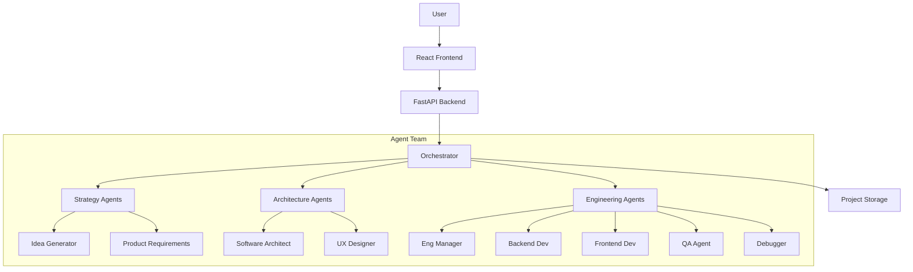

# SparkToShip AI 🚀

**From Idea to Product in Minutes.**

SparkToShip is an autonomous software engineering platform powered by Google's Agent Development Kit (ADK) and Gemini models. It orchestrates a team of specialized AI agents to plan, design, build, test, and debug full-stack web applications from a simple text prompt.

## 🏆 Hackathon Track
**Enterprise Agents**: Automating the software development lifecycle to improve developer productivity and business workflows.

## 🌟 Why SparkToShip?

Existing tools like **Cline**, **Google Jules**, or **Antigravity** are powerful but fragmented. They focus on individual coding tasks, often losing the "big picture" context.

**SparkToShip is different.** It offers a **coherent, end-to-end flow**:
1.  **Context Aware**: It knows how your Database Schema relates to your Frontend Components.
2.  **Lifecycle Managed**: It doesn't just write code; it plans (PRD), designs (Architecture), builds (Code), and verifies (E2E Tests).
3.  **Visual**: It generates live diagrams (Flowcharts, Sequence, ERD) to help you understand the system.

## ✨ Key Features

### 🤖 The Agent Team
-   **Strategy**: Idea Generator, Product Requirements (PRD), Requirement Analysis.
-   **Architecture**: Software Architect, UX Designer.
-   **Engineering**: Engineering Manager, Backend Dev, Frontend Dev, QA, Debugger.

### 🔄 The Workflow
1.  **Ideation**: Expands keywords into full product concepts.
2.  **Planning**: Generates PRDs, User Stories, and **Task-to-Story Maps**.
3.  **Design**: Creates **System Architecture**, **Sequence Diagrams**, and **ERDs** using Mermaid.js.
4.  **Development**: Writes production-ready Backend (FastAPI) and Frontend (React/Vite) code.
5.  **Quality Assurance**:
    -   **E2E Test Generation**: Creates comprehensive test plans.
    -   **Code Review**: Automated linting and best-practice checks.
6.  **Debugging**: An intelligent **Debugger Agent** that analyzes errors and applies fixes automatically.

### 🎓 Automated Walkthroughs (Onboarding)
SparkToShip solves the "handover" problem with a dedicated `WalkthroughAgent`. It analyzes the final codebase and generates:
-   **Text Walkthrough**: Detailed guides explaining the code structure.
-   **Image Walkthrough**: Visual slides highlighting key components.
-   **Video Walkthrough**: Scripted tours of the application logic.

### ⚙️ Bring Your Own Model (BYOK)
Full control over your AI infrastructure.
-   **Custom API Keys**: Use your own Google Gemini API keys.
-   **Model Selection**: Switch between **Gemini 2.5 pro** (for complex reasoning) and **Gemini 1.5 Flash** (for speed) directly from the settings.

### 🚀 Advanced Capabilities
-   **Project Persistence**: Save and **Load Projects** to resume work anytime.
-   **Code Viewer**: Built-in IDE-like viewer to explore generated files.
-   **Observability**: Real-time system logs and Kanban board for task tracking.

## 🛠️ Technology Stack

-   **Framework**: Google ADK (Agent Development Kit)
-   **Models**: Google Gemini 2.5 pro / Flash
-   **Backend**: Python, FastAPI
-   **Frontend**: React, TypeScript, Vite, TailwindCSS
-   **Visualization**: Mermaid.js

## 🚀 Getting Started

### Prerequisites
-   Python 3.10+
-   Node.js 18+
-   Google Cloud Project with Gemini API enabled

### Installation

1.  **Clone the repository**
    ```bash
    git clone https://github.com/yourusername/sparktoship.git
    cd sparktoship
    ```

2.  **Backend Setup**
    ```bash
    cd backend
    python -m venv venv
    source venv/bin/activate  # On Windows: venv\Scripts\activate
    pip install -r requirements.txt
    ```

3.  **Frontend Setup**
    ```bash
    cd frontend
    npm install
    ```

4.  **Environment Configuration**
    Create a `.env` file in the `backend` directory:
    ```env
    GOOGLE_API_KEY=your_gemini_api_key
    MODEL_NAME=gemini-1.5-flash
    ```

### Running the Application

1.  **Start the Backend**
    ```bash
    cd backend
    uvicorn app.main:app --reload --port 8000
    ```

2.  **Start the Frontend**
    ```bash
    cd frontend
    npm run dev
    ```

3.  Open your browser at `http://localhost:5173`.

## 🏗️ Architecture

SparkToShip uses a **Hub-and-Spoke** architecture where the `Orchestrator` manages the session and coordinates communication between agents.



## 🤝 Contributing
Contributions are welcome! Please feel free to submit a Pull Request.

## 📄 License
This project is licensed under the MIT License.
