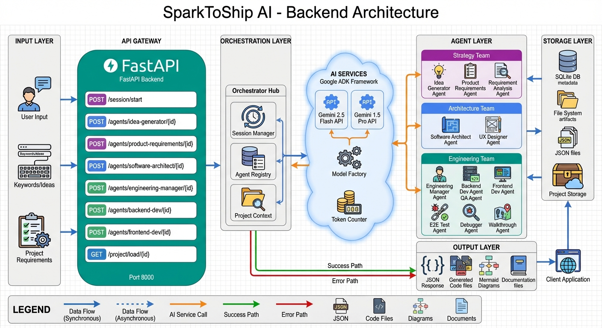
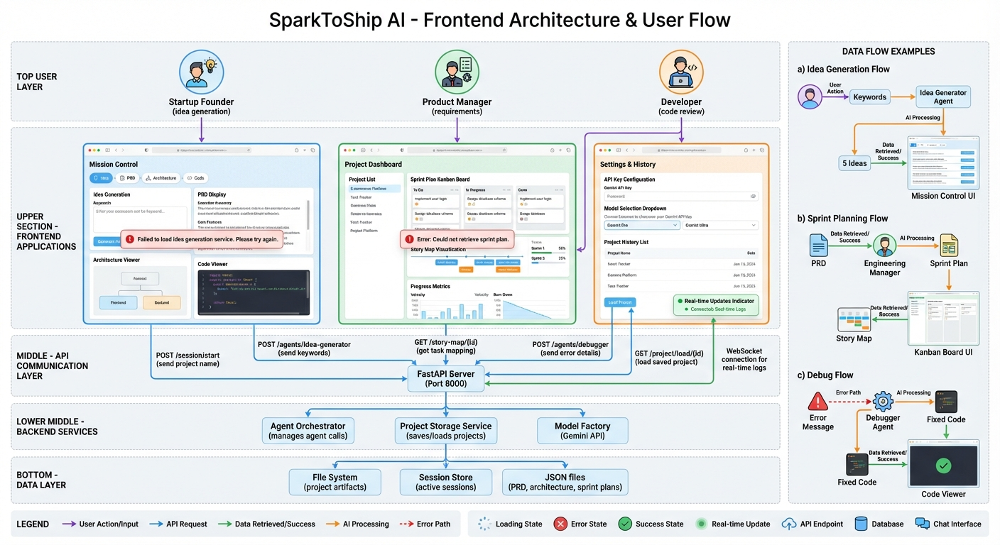

# SparkToShip AI 🚀

**From Idea to Product in Minutes.**

SparkToShip is an autonomous software engineering platform powered by Google's Agent Development Kit (ADK) and Gemini models. It orchestrates a team of specialized AI agents to plan, design, build, test, and debug full-stack web applications from a simple text prompt.

## 🏆 Kaggle Hackathon Submission
**Competition**: [Google ADK Hackathon on Kaggle](https://www.kaggle.com/)  
**Track**: Enterprise Agents - Automating the software development lifecycle to improve developer productivity and business workflows.

## 🌟 Why SparkToShip?

Existing tools like **Cline**, **Google Jules**, or **Antigravity** are powerful but fragmented. They focus on individual coding tasks, often losing the "big picture" context.

**SparkToShip is different.** It offers a **coherent, end-to-end flow**:
1.  **Context Aware**: It knows how your Database Schema relates to your Frontend Components.
2.  **Lifecycle Managed**: It doesn't just write code; it plans (PRD), designs (Architecture), builds (Code), and verifies (E2E Tests).
3.  **Visual**: It generates live diagrams (Flowcharts, Sequence, ERD) to help you understand the system.

## ✨ Key Features

### 🤖 The 12 Specialized Agents

The system is composed of **12 Specialized Agents**, each expert in their domain:

#### 1. Strategy Team

*   **Idea Generator Agent**
    *   **Role**: The Creative Director
    *   **Model**: Gemini 2.5 Flash (speed-optimized)
    *   **Function**: Takes vague user keywords (e.g., "Tinder for Cats") and expands them into 5 comprehensive product concepts, defining the target audience, core value proposition, key features, and monetization strategy
    *   **Output**: Structured JSON with 5 complete app ideas

*   **Product Requirements Agent**
    *   **Role**: The Product Manager (PM)
    *   **Model**: Gemini 2.5 Pro (reasoning-optimized)
    *   **Function**: Translates the selected concept into a formal **Product Requirement Document (PRD)**. Defines User Stories, Acceptance Criteria, Functional Requirements, and Non-Functional Requirements in structured JSON format
    *   **Output**: Complete PRD with 10-20 user stories

*   **Requirement Analysis Agent**
    *   **Role**: The Business Analyst
    *   **Model**: Gemini 2.5 Pro
    *   **Function**: Analyzes the PRD to identify technical constraints, dependencies, potential risks, and provides recommendations before any code is written
    *   **Output**: Technical analysis with constraints and recommendations

#### 2. Architecture Team

*   **Software Architect Agent**
    *   **Role**: The System Architect
    *   **Model**: Gemini 2.5 Pro (complex reasoning)
    *   **Function**: Designs the technical foundation. Generates live **Mermaid.js** code for System Architecture (flowcharts), Sequence Diagrams (API flows), ERD Schemas (database relationships), and Tech Stack recommendations
    *   **Output**: Complete architecture specification with 3+ Mermaid diagrams

*   **UX Designer Agent**
    *   **Role**: The UI/UX Lead
    *   **Model**: Gemini 2.5 Flash
    *   **Function**: Plans the frontend component hierarchy, defines the color palette (TailwindCSS), creates wireframe descriptions, and establishes responsive design guidelines
    *   **Output**: UI design specification with component tree and color system

#### 3. Engineering Team

*   **Engineering Manager Agent**
    *   **Role**: The Team Lead / Scrum Master
    *   **Model**: Gemini 2.5 Pro
    *   **Function**: Reads the Architecture and PRD to create a **Sprint Plan**. Breaks down features into atomic tasks, assigns them to developers, establishes dependencies, estimates effort, and tracks status on a Kanban board
    *   **Output**: Sprint plan with 20-50 atomic tasks, story-to-task mapping

*   **Backend Developer Agent**
    *   **Role**: Senior Python Engineer
    *   **Model**: Gemini 2.5 Flash (code generation)
    *   **Function**: Implements server-side logic using **FastAPI**. Writes clean, type-hinted Python code, sets up Pydantic models, implements API endpoints, adds error handling, and follows PEP 8 guidelines
    *   **Output**: Production-ready FastAPI code with models, routes, and services

*   **Frontend Developer Agent**
    *   **Role**: Senior React Engineer
    *   **Model**: Gemini 2.5 Flash
    *   **Function**: Builds the user interface using **React, TypeScript, Vite, and TailwindCSS**. Creates responsive components, manages state with hooks, implements routing, and integrates with backend APIs
    *   **Output**: Production-ready React/TypeScript components

#### 4. Quality & Operations Team

*   **QA Agent**
    *   **Role**: Code Reviewer
    *   **Model**: Gemini 2.5 Flash
    *   **Function**: Performs static analysis and code reviews. Checks for best practices, potential bugs, security vulnerabilities, performance issues, and provides actionable feedback
    *   **Output**: Comprehensive QA report with severity ratings

*   **E2E Test Agent**
    *   **Role**: Test Automation Engineer
    *   **Model**: Gemini 2.5 Flash
    *   **Function**: Automatically generates comprehensive **End-to-End (E2E)** test scripts based on User Stories. Covers user journeys, API integration, UI interaction, and edge cases
    *   **Output**: Complete E2E test plan with 20-50 test cases

*   **Debugger Agent** (Loop Agent)
    *   **Role**: The "Fixer"
    *   **Model**: Gemini 2.5 Pro (complex debugging)
    *   **Function**: When errors occur, this agent intercepts stack traces, analyzes code context, proposes fixes, applies them, and re-runs verification in an **autonomous loop** until issues are resolved
    *   **Output**: Debug report with root cause analysis and fixed code
    *   **Loop Behavior**: Continues iterating until error is resolved or max iterations reached

*   **Walkthrough Agent**
    *   **Role**: The Developer Advocate
    *   **Model**: Gemini 2.5 Pro
    *   **Function**: Analyzes the final codebase and generates onboarding materials in three formats: **Text** (comprehensive markdown guide), **Image** (visual slides), and **Video** (scripted application tour)
    *   **Output**: Living documentation in text, image, and video formats

### 🔄 The Workflow
1.  **Ideation**: Expands keywords into full product concepts.
2.  **Planning**: Generates PRDs, User Stories, and **Task-to-Story Maps**.
3.  **Design**: Creates **System Architecture**, **Sequence Diagrams**, and **ERDs** using Mermaid.js.
4.  **Development**: Writes production-ready Backend (FastAPI) and Frontend (React/Vite) code.
5.  **Quality Assurance**:
    -   **E2E Test Generation**: Creates comprehensive test plans.
    -   **Code Review**: Automated linting and best-practice checks.
6.  **Debugging**: An intelligent **Debugger Agent** that analyzes errors and applies fixes automatically.

### 🎓 Automated Walkthroughs (Onboarding)
SparkToShip solves the "handover" problem with a dedicated `WalkthroughAgent`. It analyzes the final codebase and generates:
-   **Text Walkthrough**: Detailed guides explaining the code structure.
-   **Image Walkthrough**: Visual slides highlighting key components.
-   **Video Walkthrough**: Scripted tours of the application logic.

### ⚙️ Bring Your Own Model (BYOM)
Full control over your AI infrastructure.
-   **Custom API Keys**: Use your own Google Gemini API keys.
-   **Model Selection**: Switch between **Gemini 2.5 pro** (for complex reasoning) and **Gemini 2.5 Flash** (for speed) directly from the settings.

### 🚀 Advanced Capabilities
-   **Project Persistence**: Save and **Load Projects** to resume work anytime.
-   **Code Viewer**: Built-in IDE-like viewer to explore generated files.
-   **Observability**: Real-time system logs and Kanban board for task tracking.

### ✏️ **Edit Before You Build** (New!)
Take full control of the AI-generated content before code generation:
-   **Edit PRD**: Refine product requirements, add missing features, clarify specifications
-   **Edit User Stories**: Add, remove, or modify user stories with a visual editor
-   **Edit Architecture**: Customize tech stack, modify diagrams, adjust database schemas
-   **All Changes Saved**: Your edits persist and are used for code generation

👉 **[Read the Editing Guide](./EDITING_GUIDE.md)** for detailed instructions.

## 🛠️ Technology Stack

-   **Framework**: Google ADK (Agent Development Kit)
-   **Models**: Google Gemini 2.5 pro / Flash
-   **Backend**: Python, FastAPI
-   **Frontend**: React, TypeScript, Vite, TailwindCSS
-   **Visualization**: Mermaid.js

## 🚀 Getting Started

### Prerequisites
-   Python 3.10+
-   Node.js 18+
-   Google Cloud Project with Gemini API enabled

### Installation

1.  **Clone the repository**
    ```bash
    git clone https://github.com/yourusername/sparktoship.git
    cd sparktoship
    ```

2.  **Backend Setup**
    ```bash
    cd backend
    python -m venv venv
    source venv/bin/activate  # On Windows: venv\Scripts\activate
    pip install -r requirements.txt
    ```

3.  **Frontend Setup**
    ```bash
    cd frontend
    npm install
    ```

4.  **Environment Configuration**
    Create a `.env` file in the `backend` directory:
    ```env
    GOOGLE_API_KEY=your_gemini_api_key
    MODEL_NAME=gemini-2.5-flash-lite
    ```

### Running the Application

1.  **Start the Backend**
    ```bash
    cd backend
    uvicorn app.main:app --reload --port 8000
    ```

2.  **Start the Frontend**
    ```bash
    cd frontend
    npm run dev
    ```

3.  Open your browser at `http://localhost:5173`.


## 🏗️ Architecture

SparkToShip uses a **Hub-and-Spoke** architecture where the `Orchestrator` manages the session and coordinates communication between agents.

### Backend Architecture

The backend is built with FastAPI and orchestrates 12 specialized AI agents powered by Google ADK and Gemini models.



**Key Components:**
- **API Gateway**: FastAPI server exposing RESTful endpoints for agent interactions
- **Orchestration Layer**: Session management and agent registry
- **AI Services**: Google ADK Framework with Gemini 2.5 Flash and Gemini 2.5 Pro models
- **Agent Teams**: 
  - Strategy Team (Idea Generator, PRD, Analysis)
  - Architecture Team (Software Architect, UX Designer)
  - Engineering Team (Eng Manager, Backend/Frontend Devs, QA, Debugger, Walkthrough)
- **Storage Layer**: SQLite DB and file system for project persistence

### Frontend Architecture

The frontend is a modern React application with TypeScript, providing an intuitive interface for the entire development workflow.



**Key Components:**
- **Routing Layer**: React Router for client-side navigation
- **Layout Layer**: Dashboard with sidebar, header, and project navigation
- **Page Layer**: Mission Control, Project History, and Boardroom (Kanban)
- **Component Layer**: Architecture Viewer, Code Viewer, Story Map, Test Plan, Walkthroughs
- **State Management**: Context API for global state
- **Service Layer**: Axios-based API client for backend communication

---

📚 **For detailed architecture diagrams** including system overview, agent ecosystem, data flow, deployment architecture, and sequence diagrams, see [ARCHITECTURE_DIAGRAMS.md](./ARCHITECTURE_DIAGRAMS.md).

## 📸 Demo Screenshots

Want to see SparkToShip in action? Check out our comprehensive visual walkthrough showing the complete workflow from idea to production:

👉 **[View Demo Screenshots](./DEMO.md)**

The demo showcases:
- Model configuration and mission control
- Idea generation and brainstorming
- Product requirements and user personas
- Architecture diagrams and technology stack
- Engineering sprint and agent collaboration
- Code generation, testing, and walkthroughs

### 🎥 Video Demo
Watch the full demonstration on YouTube:  
[](https://youtu.be/o1i64FRntTY)

---

## 🌐 Live Demo

**Try it now**: [https://www.sparktoship.dev](https://www.sparktoship.dev)

### Quick Start Guide

1. **Configure Settings** ⚙️
   - Click the settings icon (top right)
   - Select your model (recommended: **Gemini 2.5 Flash** - tested and works well)
   - Add your Gemini API key
   - Save settings

2. **Start a New Project** 🚀
   - Go to **Mission Control**
   - Enter a project name (e.g., "Recipe Sharing App")

3. **Brainstorm Ideas** 💡
   - Enter your project idea in the text box
   - Click **"Brainstorm"**
   - The Idea Generator Agent will create 5 detailed product concepts

4. **Generate Product Requirements** 📋
   - Select your favorite idea
   - Click **"Generate PRD"**
   - The Product Requirements Agent creates a complete PRD with user stories

5. **Analyze Requirements** 🔍
   - Click **"Analyze Requirements"**
   - The Requirement Analysis Agent identifies constraints and dependencies

6. **Design Architecture** 🏗️
   - Click **"Generate Architecture"**
   - The Software Architect Agent creates:
     - System architecture diagrams (Mermaid flowcharts)
     - Sequence diagrams (API flows)
     - Tech stack recommendations

7. **Create Sprint Plan & Start Coding** 📊💻
   - Click **"Create Sprint Plan"**
   - The Engineering Manager Agent breaks down features into atomic tasks
   - Sprint execution **automatically begins**
   - Backend and Frontend Developer Agents start writing production-ready code
   - Monitor task progress in real-time in the System Logs

8. **Resume Sprint (If Needed)** 🔄
   - If sprint pauses due to:
     - API rate limits
     - Token exhaustion
     - Network errors
   - Click **"Resume Sprint Execution"** to continue where it left off
   - Or click **"Run"** on individual tasks to execute them one by one
   - View generated files in the **"View & Debug Code"** section

9. **Generate E2E Tests** ✅
   - After sprint completion, click **"Generate E2E Test Plan"**
   - The E2E Test Agent automatically creates comprehensive test plans
   - View test cases and execution plans

10. **Generate Walkthrough** 📚
    - Click **"Generate Code Walkthrough"**
    - The Walkthrough Agent creates:
      - Text-based code walkthrough
      - Image-based visual guide
      - Video script walkthrough

11. **Download Your Code** 📦
    - Go to **Projects** tab in the sidebar
    - Select your project from the list
    - Click **"Download"** to get a ZIP file with all generated code
    - Extract and run locally!

12. **Load Previous Projects** 💾
    - Go to **Project History**
    - Click on any previous project to resume work

---

### 🔒 Security & Privacy

**API Key Safety**: Your Gemini API key is:
- ✅ **Stored only in your browser** (localStorage)
- ✅ **Never sent to our servers** (only to Google's Gemini API)
- ✅ **Not saved across sessions** (cleared when you close the browser)
- ✅ **Completely private** to you

Your API key is safe and secure. We never see or store it.

---

### ⚠️ Important Notes

**LLM Behavior**: Like all LLM-powered tools, SparkToShip agents may occasionally:
- Generate code with syntax errors
- Hallucinate non-existent APIs or libraries
- Produce Mermaid diagrams with rendering issues

We've implemented robust error handling and validation, but we recommend reviewing generated code before deployment. The platform is designed for rapid prototyping and learning, not production-critical systems without human review.

---

### 🚀 Future Roadmap

We're actively working on exciting new features:

1. **GitHub Integration** 🐙
   - One-click repository creation
   - Automatic code commit and push
   - Branch management and PR creation

2. **Live Code Preview** 👁️
   - In-browser code execution
   - Real-time output visualization
   - Interactive debugging console

3. **User Authentication & Privacy** 🔐
   - Personal accounts with secure login
   - Private project workspaces
   - Team collaboration features
   - Project sharing controls

4. **Specialized Agent Teams** 🤖
   - **ML/AI Agents**: TensorFlow, PyTorch, model training
   - **Data Science Agents**: Pandas, NumPy, data analysis
   - **Gen AI Agents**: LangChain, RAG, vector databases
   - **DevOps Agents**: Docker, Kubernetes, CI/CD pipelines
   - **Mobile Agents**: React Native, Flutter, iOS/Android

Stay tuned for updates!

---

## 🤝 Contributing
Contributions are welcome! Please feel free to submit a Pull Request.

## 📄 License
This project is licensed under the MIT License.
