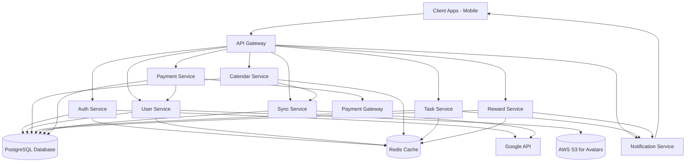
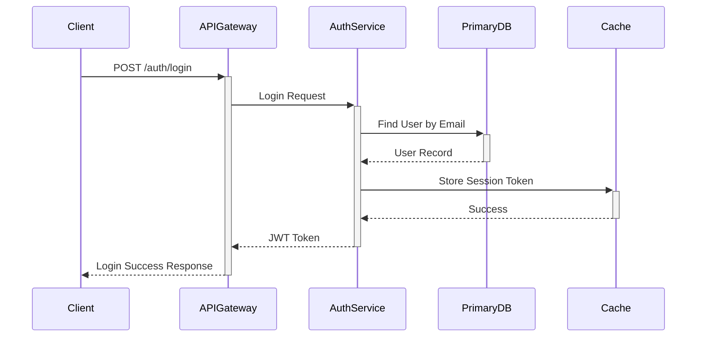

# Implementation Guide: FamilyFlow

This document provides an overview of the technical architecture, design principles, and data models for the FamilyFlow application.

## 1. Architecture Overview

FamilyFlow employs a microservices-oriented backend architecture deployed on AWS, communicating via an API Gateway. The frontend is built with React Native, ensuring cross-platform compatibility.

### 1.1. System Diagram

### 1.2. Backend Services

*   **API Gateway:** Single entry point for all client requests, routing them to appropriate backend services.
*   **Auth Service:** Handles user registration, login, JWT generation, and Google OAuth integration.
*   **User Service:** Manages user profiles, family relationships, and avatar storage (AWS S3).
*   **Calendar Service:** Manages family events, categories, and recurring event logic.
*   **Task Service:** Handles creation, assignment, and status updates for tasks.
*   **Reward Service:** Manages reward definitions, point systems, and redemption requests.
*   **Notification Service:** Sends real-time notifications (e.g., via WebSockets) to clients.
*   **Sync Service:** Manages synchronization with external services, primarily Google Calendar.
*   **Payment Service:** Integrates with payment gateways for subscription management.

### 1.3. Frontend

*   **Framework:** React Native
*   **State Management:** Redux Toolkit
*   **UI Library:** React Native Paper
*   **Language:** TypeScript

## 2. API Design Principles

*   **RESTful Design:** Utilize standard HTTP methods (GET, POST, PUT, DELETE) and resource-based URLs. Responses will be in JSON format.
*   **Statelessness:** Each request must contain all necessary information. The server should not store client context between requests.
*   **Authentication:** JWT (JSON Web Tokens) for session management. OAuth 2.0 for third-party authentication (Google Sign-In).
*   **Authorization:** Implement role-based access control to ensure users can only access authorized resources.
*   **Versioning:** APIs will be versioned (e.g., `/api/v1/...`) to allow for backward-incompatible changes.
*   **Error Handling:** Provide consistent, informative error responses using appropriate HTTP status codes and JSON error payloads.
*   **Idempotency:** Design critical operations to be idempotent where feasible to prevent duplicate actions.

## 3. Data Model

The primary data store is PostgreSQL. Key tables include:

*   **`users`**: Stores user credentials, profile information, roles, and parent-child relationships.
*   **`family_members`**: Links users to specific families and defines their role within that family.
*   **`events`**: Contains details of calendar events, including recurrence rules and assignments.
*   **`event_categories`**: Defines customizable categories for events (e.g., 'Sports', 'Academics') with color codes.
*   **`tasks`**: Stores task details, assignments, due dates, and status.
*   **`rewards`**: Defines available rewards and their associated point costs.
*   **`reward_redemptions`**: Tracks individual reward redemption requests.
*   **`user_points`**: Stores the current point balance for each user.
*   **`notifications`**: Stores notification messages and read status for users.
*   **`subscriptions`**: Manages user subscription plans and payment gateway details.

*(Refer to the `data_model.schema` in the `context` for detailed table and column definitions.)*

## 4. Key Technical Decisions

*   **Node.js/Express.js:** Chosen for its performance, large ecosystem, and suitability for building scalable APIs.
*   **PostgreSQL:** Robust relational database for structured data and complex queries.
*   **Redis:** Used for caching frequently accessed data to improve performance.
*   **Docker:** Containerization for consistent development, testing, and deployment environments.
*   **AWS:** Cloud provider for hosting services (EC2), managed databases (RDS), and object storage (S3).
*   **GitHub Actions:** CI/CD pipeline for automated testing and deployment.
*   **JWT & OAuth:** Standard protocols for secure authentication and third-party sign-ins.
*   **WebSockets (Socket.IO):** For real-time features like live updates on shared calendars.

## 5. Sequence Diagrams

### 5.1. User Login Flow

*(Additional sequence diagrams for other key features can be added here.)*
